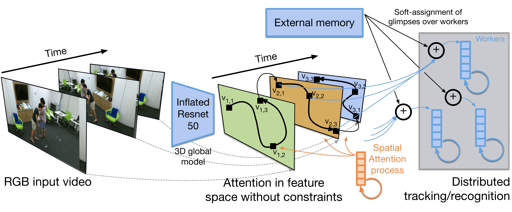

# Glimpse Clouds

This repository will contain the code of the paper ["Glimpse Clouds: Human Activity Recognition from Unstructured Feature Points"](http://openaccess.thecvf.com/content_cvpr_2018/papers/Baradel_Glimpse_Clouds_Human_CVPR_2018_paper.pdf) by F. Baradel, C. Wolf, J. Mille and G.W. Taylor presented at CVPR 2018.


Check out the [project page](https://fabienbaradel.github.io/cvpr18_glimpseclouds/) for more information.


### Data preprocessing
You should download the [NTU-DATASET](https://github.com/shahroudy/NTURGB-D) and install the [`lintel`](https://github.com/dukebw/lintel) module for efficiently decoding videos on the fly.
Check the dataprocessing [README](src/data/preprocessing/README.md) for more information about how to rescale the videos.

### Dataloader
Run the following python command to make sure you are able to iterate over the videos.
```
python ./src/data/ntu/test.py
```

### Training
The training is split into two steps:
1) We train the 3D-CNN using global average pooling
2) We freeze the backbone and train the Glimpse Clouds
This can be done by running the following command:
```shell
./script/train_and_evaluate.sh <DIR-CKPT> <LOCATION-NTU> 
```
where `<DIR-CKPT>` is where you want to store your files (log, checkpoints) and `<LOCATION-NTU>` is the location of the NTU dataset on your cluster.

Below is teh generic python command for running the code
```shell
python src/main.py \
--dir <DIR-CKPT> \
--root <DATA> \
-b <BATCH-SIZE> \
-t <NB-TIMESTEPS> \
-lr <LEARNING-RATE> \
--epochs <EPOCHS> \
-j <NB-WORKERS> \
```
You need to adding either `--global-model` or `--glimpse-clouds` for training respectively the backbone-CNN or the glimpse clouds.
Pose predictions can be added by adding the option `--pose-predictions`.
Evaluation can be done by adding the option `-e`.

### Requirements
* python 3 and higher
* pytorch 0.4
* [lintel](https://github.com/dukebw/lintel)

### Citation
If our paper and/or this code is useful for your research, please consider citing us:

```
@InProceedings{Baradel_2018_CVPR,
author = {Baradel, Fabien and Wolf, Christian and Mille, Julien and Taylor, Graham W.},
title = {Glimpse Clouds: Human Activity Recognition From Unstructured Feature Points},
booktitle = {The IEEE Conference on Computer Vision and Pattern Recognition (CVPR)},
month = {June},
year = {2018}
}
```

### Licence

MIT License
