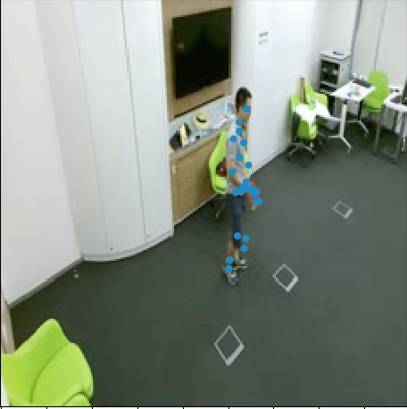

NTU dataloader
======================================================

Loop over the examples of the dataset
             
## Example

```shell
# Python test command
python test.py \
--root /Users/fabien/Datasets/NTU-RGB-D \
--avi-dir avi_256x256_30 \
--width 224 \
--height 224 \
--time 8 \
-j 0 \
-b 2
```

The command will show a frame of a video clip and show the 25 human joints like the image below:
